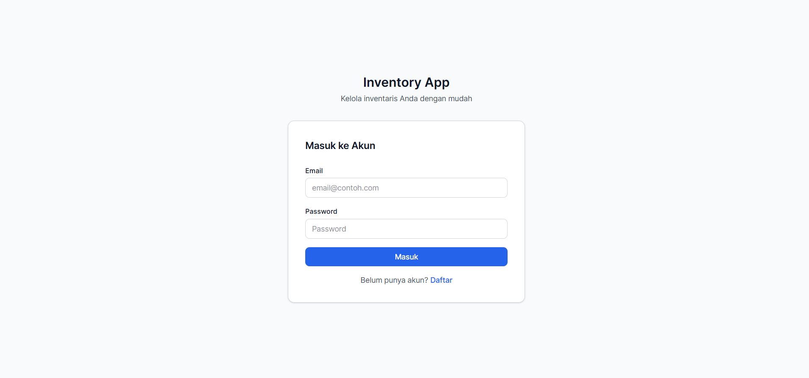
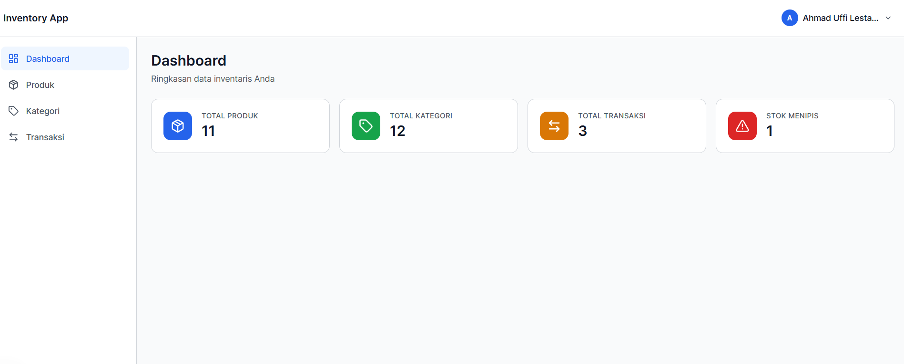
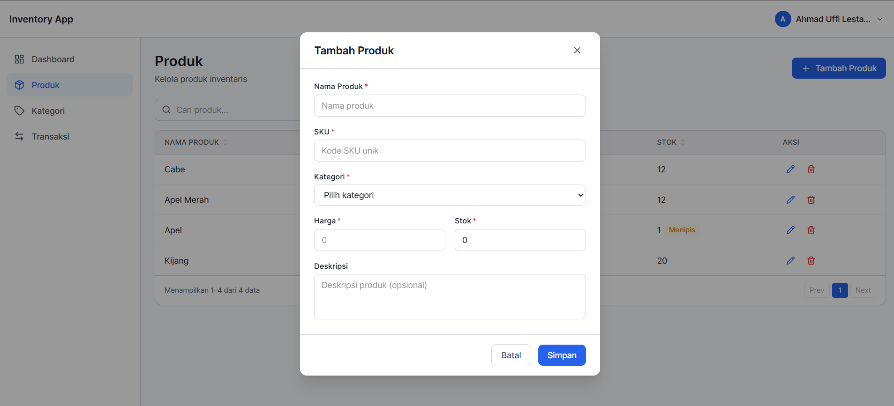
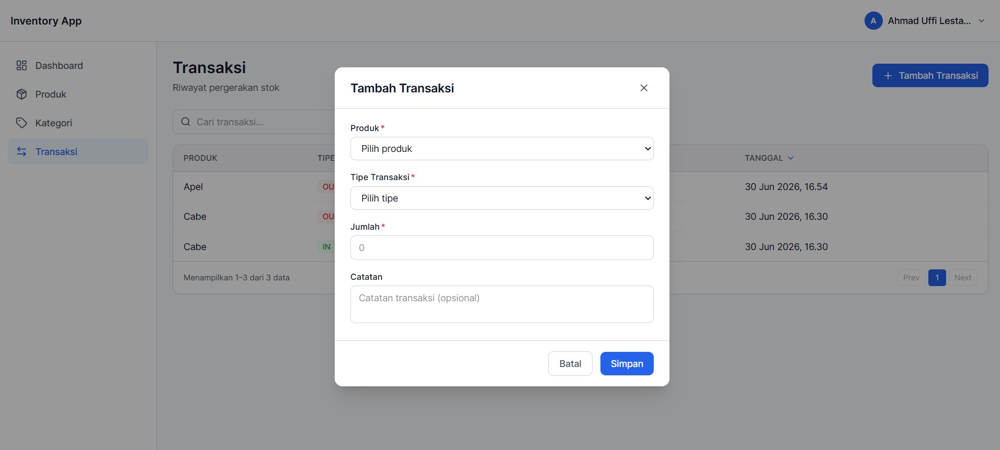
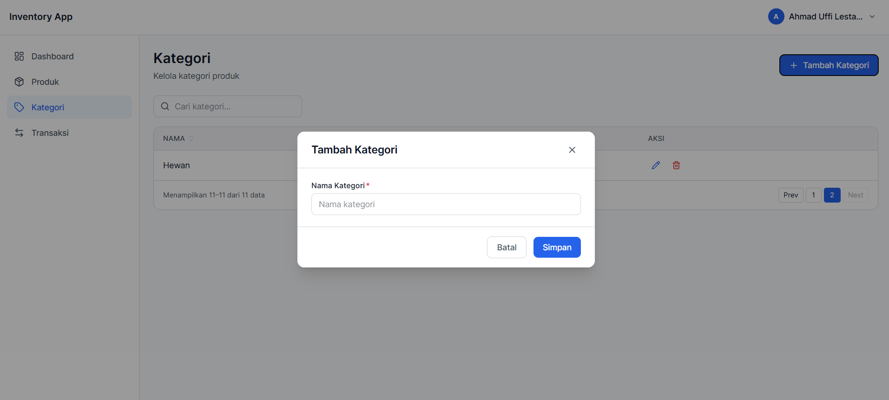

# Aplikasi Manajemen Inventori

> **Posisi yang dilamar: Frontend**

Aplikasi web untuk mengelola inventori toko — mencatat produk, kategori, dan transaksi stok masuk/keluar. Dilengkapi dashboard ringkasan, pencarian, pengurutan, serta notifikasi stok menipis.

---

## Tampilan Aplikasi

### Auth



### Dashboard



### Produk



### Transaksi



### Kategori

## 

## Fitur

| Fitur                      | Deskripsi                                                          |
| -------------------------- | ------------------------------------------------------------------ |
| **Autentikasi**            | Register & login dengan JWT, dilindungi per-user                   |
| **Dashboard**              | Ringkasan total produk, kategori, transaksi, dan stok menipis      |
| **Manajemen Produk**       | Tambah, edit, hapus produk; filter by kategori; badge stok menipis |
| **Manajemen Kategori**     | Tambah, edit, hapus kategori produk                                |
| **Transaksi Stok**         | Catat stok masuk (IN) dan keluar (OUT), stok otomatis terupdate    |
| **Pencarian & Pengurutan** | Search + sort kolom di semua halaman                               |
| **Paginasi**               | Navigasi data halaman per halaman                                  |

---

## Tech Stack

### Backend

| Library        | Versi   |
| -------------- | ------- |
| Node.js        | ≥ 18    |
| Express        | ^5.2.1  |
| Prisma (ORM)   | ^5.22.0 |
| MySQL          | 8.x     |
| JSON Web Token | ^9.0.3  |
| bcrypt         | ^6.0.0  |
| Zod (validasi) | ^4.4.3  |
| dotenv         | ^17.4.2 |
| cors           | ^2.8.6  |
| nodemon (dev)  | ^3.1.14 |

### Frontend

| Library             | Versi   |
| ------------------- | ------- |
| React               | ^19.2.7 |
| Vite                | ^8.1.0  |
| Tailwind CSS        | ^4.3.2  |
| React Router DOM    | ^7.18.1 |
| Axios               | ^1.18.1 |
| Zustand (state)     | ^5.0.14 |
| React Hook Form     | ^7.80.0 |
| Zod (validasi)      | ^4.4.3  |
| Lucide React (ikon) | ^1.22.0 |
| React Hot Toast     | ^2.6.0  |

---

## Instalasi

### Prasyarat

- Node.js ≥ 18
- MySQL 8.x (pastikan sudah berjalan)

### 1. Clone Repository

```bash
git clone https://github.com/ahmadUffi/magang-inventori-app.git
cd  magang-inventori-app
```

### 2. Setup Backend

```bash
cd backend
npm install
```

Salin file konfigurasi dan isi sesuai environment:

```bash
cp .env.example .env
```

Edit file `.env` yang baru disalin:

```env
DATABASE_URL="mysql://root:<password>@localhost:3306/inventory_db"
JWT_SECRET="isi_dengan_string_acak_minimal_32_karakter"
JWT_EXPIRES_IN="7d"
PORT=3000
```

Jalankan migrasi database:

```bash
npx prisma migrate dev
npx prisma generate
```

Jalankan server backend:

```bash
npm run dev
```

### 3. Setup Frontend

Buka terminal baru, lalu:

```bash
cd forntend
npm install
```

Salin file konfigurasi:

```bash
cp .env.example .env
```

Edit `.env`, ganti `port` sesuai port backend (default `3000`):

```env
VITE_API_URL=http://localhost:port/api
```

Jalankan server frontend:

```bash
npm run dev
```

---

## Akses Aplikasi

| Layanan       | URL                                                                 |
| ------------- | ------------------------------------------------------------------- |
| Frontend      | http://localhost:5173                                               |
| Backend API   | http://localhost:3000/api                                           |
| Prisma Studio | http://localhost:5555 (jalankan `npm run studio` di folder backend) |

---

## Struktur Folder

```
├── backend/
│   ├── prisma/          # Schema & migrasi database
│   ├── src/
│   │   ├── controllers/ # Request handler
│   │   ├── services/    # Business logic
│   │   ├── routes/      # Definisi endpoint
│   │   ├── middlewares/ # Auth, validasi, error handler
│   │   ├── validations/ # Zod schema validasi
│   │   └── utils/       # Helper (JWT, hash, response)
│   └── package.json
│
└── forntend/
    ├── src/
    │   ├── pages/       # Halaman (Auth, Dashboard, Produk, dll)
    │   ├── components/  # Komponen UI reusable
    │   ├── services/    # Axios API calls
    │   ├── hooks/       # Custom hooks
    │   ├── stores/      # Zustand state management
    │   └── constants/   # Konstanta aplikasi
    └── package.json
```
